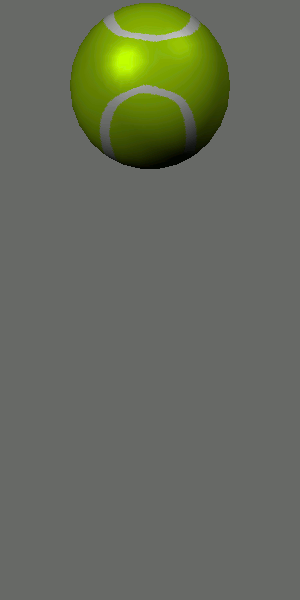

## About The Project

This is a rendering of a bouncing ball in OpenGL. My main contribution to project.cpp was the following: creating the sphere, developing the sphere's vertical movement and squash & stretch effect (animation), applying the spherical texture map and specular highlights.

For a progress timeline and the documentation of this project, visit my project's website [here](https://cs.csub.edu/~jperaltadomi/3480/).



### Built With

*  [OpenGL](https://www.opengl.org/)

## Getting Started

To get a local copy up and running follow these steps. Please note that these steps are for running the program on Ubuntu Linux.

### Prerequisites

This is a list of things you need to use the program and how to install them.

* git

```

sudo apt-get install git-all

```

* libraries

```

sudo apt-get install libglu1-mesa-dev freeglut3-dev mesa-common-dev

```

### Installation

1. Clone the repo

```

git clone https://github.com/jackyperalta/bouncing_ball.git

```

2. Move into the bouncing_ball directory

3. Run Makefile

```

make clean

make

```

4. Run the program

```

./project

```